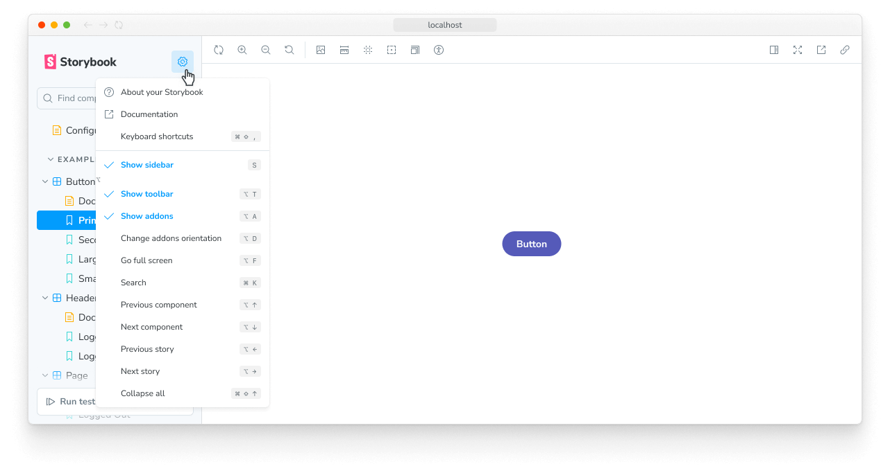
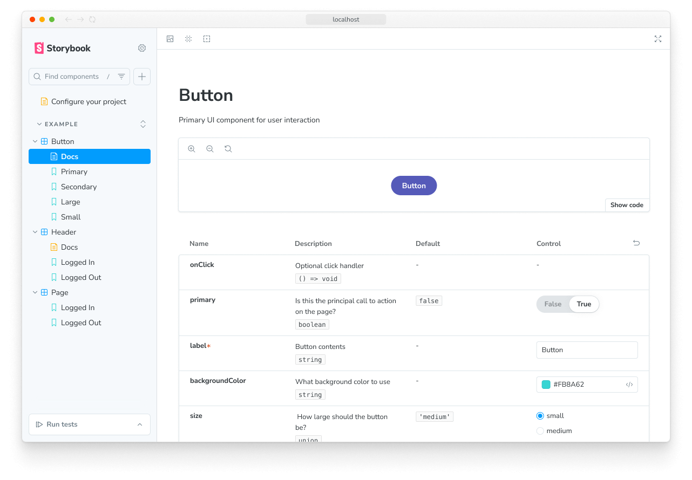
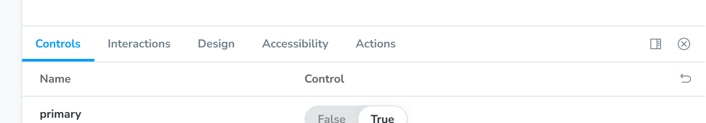
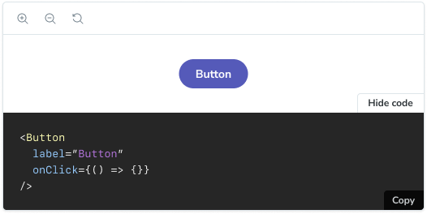

> 🌐 本文档由 [storybookjs/storybook](https://github.com/storybookjs/storybook) 翻译，英文原版见原项目。

上一章我们学习了 stories 对应组件的离散状态。本章演示如何把 Storybook 当作构建组件的工作台来使用。

## 侧边栏与预览

一个 `*.stories.js|ts|svelte` 文件定义了一个组件的所有 stories。每个 story 在侧边栏都有一个对应条目。点击某个 story，它会在一个隔离的预览 iframe 中渲染。

<Video src="../_assets/get-started/example-browse-all-stories-optimized.mp4" />

侧边栏包含三个区域：侧边栏搜索、story 浏览器和[测试小组件](../writing-tests/index.mdx)。试试侧边栏搜索，按名称查找 story；在浏览器中点击 stories 来切换；使用侧边栏底部的小组件为所有 stories 运行组件测试。

也可以使用键盘快捷键。点击 Storybook 菜单可查看可用快捷键列表。

<Callout variant="info" icon="♿">

Storybook 支持在地标区域之间快速键盘导航。按 <kbd>F6</kbd> 和 <kbd>Shift+F6</kbd> 可以在侧边栏、工具栏、预览和 addons 面板之间切换。

</Callout>

## 工具栏

Storybook 内置了省时工具。工具栏包含以下工具，可调整 story 在 Canvas 中的呈现方式：

- 🔍 缩放（Zoom）：在视觉上放大组件，方便检查细节。
- 🖼 背景（Background）：更换组件背后的渲染背景，验证组件在不同视觉环境下的呈现。
- 📐 网格（Grid）：在网格布局之上渲染组件，检查组件是否对齐。
- 📏 测量（Measure）：切换测量覆盖层，帮你检查组件的尺寸。
- 🎚️ 轮廓（Outline）：显示组件的包围盒，验证组件位置是否正确。
- 📱 视口（Viewport）：以各种尺寸和方向渲染组件，是检查组件响应式表现的理想工具。

<Video src="../_assets/get-started/toolbar-walkthrough-optimized.mp4" />

[“Docs”](../writing-docs/index.mdx) 页面展示组件的自动生成文档（从源码推断）。例如在应用中与团队共享可复用组件时，用法文档非常有用。

工具栏是可定制的。你可以使用 [globals](../essentials/toolbars-and-globals.mdx) 快速切换主题和语言，或者安装社区的 Storybook 工具栏 [addon](../configure/user-interface/storybook-addons.mdx) 来启用高级工作流。

## Addons

Addon 是扩展 Storybook 核心功能的插件。它们位于 addons 面板——Storybook UI 中 Canvas 下方的一块保留区域。每个标签页展示所选 story 由该 addon 生成的元数据、日志或静态分析。

- **Controls**：让你动态操作组件的 args（输入）。试验组件的不同配置，发现边界情况。
- **Actions**：帮你验证交互通过回调产生正确的输出。例如，在 `Header` 组件的 “Logged In” story 中，我们可以验证点击 “Log out” 按钮会触发 `onLogout` 回调——该回调由使用 Header 的组件提供。
- **Interactions**：为调试带 `play` 函数的[交互测试](../writing-tests/interaction-testing.mdx)提供一个实用的界面。
- **Accessibility**：帮你发现组件中的[无障碍违规](../writing-tests/accessibility-testing.mdx)。
- **Visual Tests**：直接在 Storybook 中提供即时反馈，让你在本地开发环境中精确定位 UI bug。

<Video src="../_assets/get-started/addons-walkthrough-optimized.mp4" />

Storybook 是可扩展的。我们丰富的 addon 生态帮你测试、记录并优化你的 stories。你也可以创建自己的 addon 来满足工作流需求。更多内容见 [addons 章节](../addons/index.mdx)。

下一章，我们将让你的组件在 Storybook 中渲染起来，用它为组件开发提速。

## 用 stories 构建 UI

构建应用时，最大的挑战之一是弄清楚某段 UI 是否已存在于代码库中，以及如何在你要开发的新功能中使用它。

Storybook 为你所有的组件及其用例建立了目录。因此，你可以快速浏览它，找到你要找的东西。

工作流如下：

- 🗃 用侧边栏找到合适的组件
- 👀 查看它的 stories，挑选符合需求的变体
- 📝 把 story 定义复制/粘贴进应用代码，接上数据

你可以从 stories 文件中获取 story 定义，或者通过 [Docs addon](../api/doc-blocks/doc-block-source.mdx) 让它在已发布的 Storybook 中可用。

