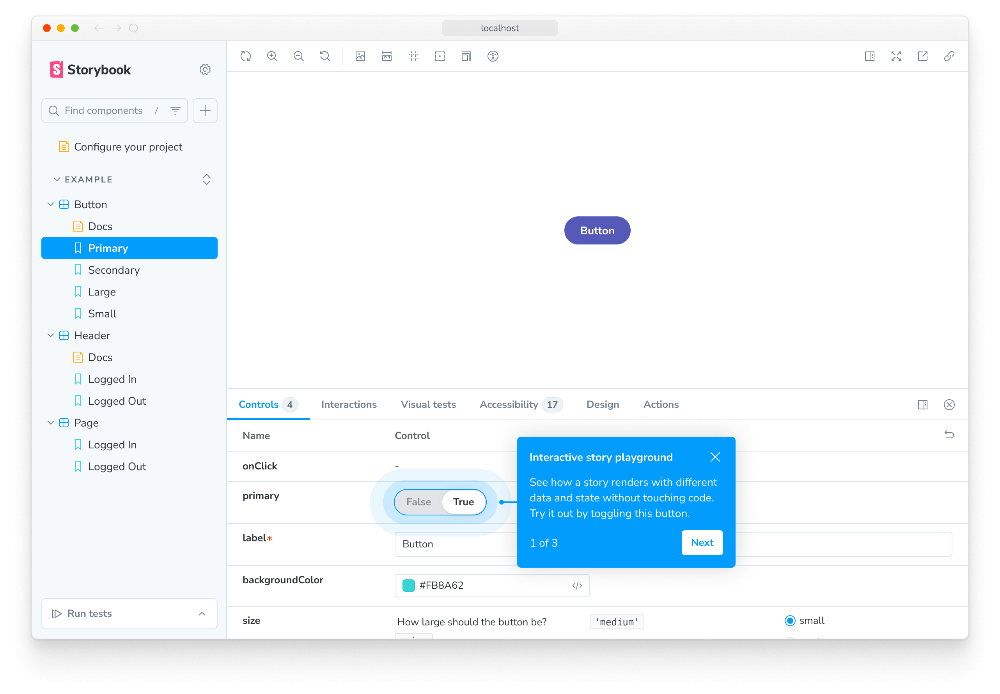
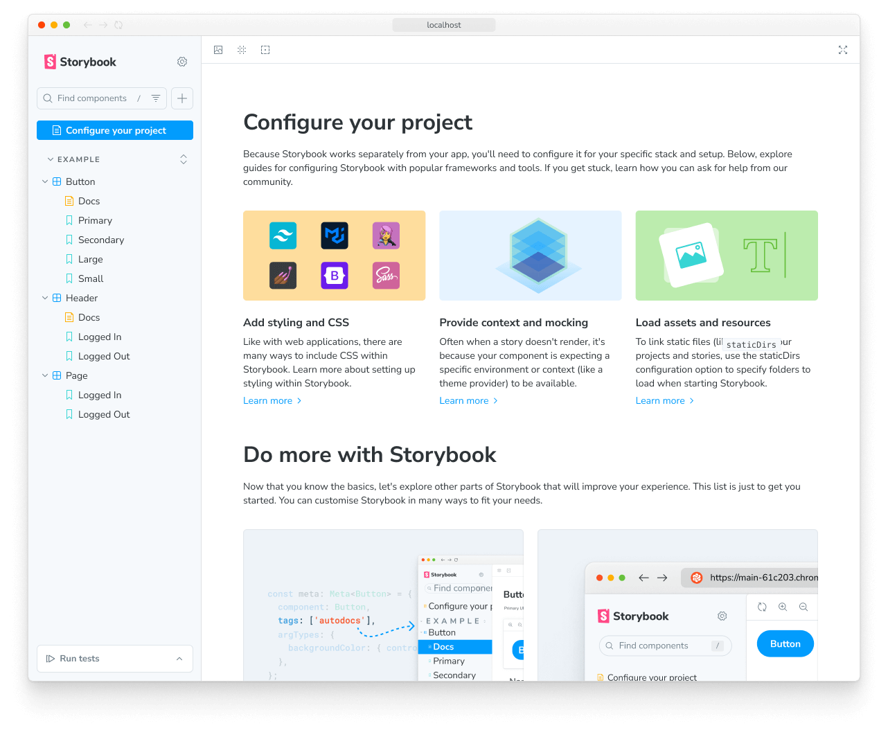

> 🌐 本文档由 [storybookjs/storybook](https://github.com/storybookjs/storybook) 翻译，英文原版见原项目。

使用 Storybook CLI 一条命令即可完成安装。在项目根目录中运行：

<CodeSnippets path="create-command.md" variant="new-users" copyEvent="CreateCommandCopy" />

<Callout
  variant="info"
  icon="🤖"
  action={{
    label: 'Copy prompt',
    copy: 'Set up Storybook for me with npm create storybook@latest and follow its instructions precisely',
    event: 'PromptInstallCopy',
  }}
>

让你的 AI 代理[帮你安装 Storybook](../ai/setup.mdx)。

</Callout>

Storybook 会在安装过程中检查项目依赖，并为你提供当前可用的最佳配置。

<YouTubeCallout id="CtfU1UnizHU" title="New Storybook" style={{ marginTop: '1em' }} />

## 项目要求

Storybook 设计为可适配多种框架和环境。如果你的项目使用了下面列出的某个包，请确保安装了以下版本：

<div style={{ columns: 2, marginBottom: "1.5rem" }}>

- Angular 18+
- Lit 3+
- Next.js 14+
- Node.js 20+
- npm 10+
- pnpm 9+
- Preact 8+
- React Native 0.72+
- React Native Web 0.19+
- Svelte 5+
- SvelteKit 1+
- TypeScript 4.9+
- Vite 5+
- Vitest 3+
- Vue 3+
- Webpack 5+
- Yarn 4+

</div>

此外，Storybook 应用支持以下浏览器：

- Chrome 131+
- Edge 134+
- Firefox 136+
- Safari 18.3+
- Opera 117+

<details>
<summary>如何在旧版浏览器中使用 Storybook？</summary>

有两种方式在旧版浏览器中使用 Storybook：

1. 使用 `9.0.0` 之前的 Storybook 版本，其要求较为宽松。
2. 以[“仅预览”模式](../sharing/publish-storybook.mdx#build-storybook-for-older-browsers)开发或构建你的 Storybook，它可以在较旧、不受支持的浏览器中使用。

</details>

## 安装

在项目根目录运行以下命令，安装最新版本的 Storybook：

<CodeSnippets path="create-command.md" variant="new-users" copyEvent="CreateCommandCopy" />

<details id="custom-storybook-version">
<summary>安装指定版本</summary>

要安装 Storybook 8.3 或更新版本，可以在 `create` 命令中指定版本：

<CodeSnippets path="create-command-custom-version.md" />

要安装 8.3 之前的 Storybook 版本，必须使用 `init` 命令：

<CodeSnippets path="init-command-custom-version.md" />

对这两个命令，你都可以指定 npm tag（如 `latest` 或 `next`）或（部分）版本号。例如：

- `storybook@latest init` 会初始化最新版本
- `storybook@7.6.10 init` 会初始化 `7.6.10`
- `storybook@7 init` 会初始化最新的 `7.x.x` 版本

</details>

安装时，Storybook 会通过一系列交互式提问帮你定制安装：

**第一次使用 Storybook？**

Storybook 会询问你是否初次使用。如果选择“是”：

- 你将看到一段交互式引导教程
- 会创建示例 stories 帮助你学习

如果你已是 Storybook 老手，可以跳过引导，获得最小化配置。

**要安装哪种配置？**

Storybook 会询问你想安装哪种配置：

- **推荐（Recommended）**：包含组件开发、[文档](../writing-docs/autodocs.mdx)、[测试](../writing-tests/integrations/vitest-addon/index.mdx)和[无障碍](../writing-tests/accessibility-testing.mdx)功能
- **最小（Minimal）**：仅组件开发所需的最基本内容

你也可以用 `--features` 标志手动选择这些功能。例如：

```bash
npm create storybook@latest --features docs test a11y
```

完成提问后，上述命令会对本地环境做以下改动：

- 📦 安装所需依赖。
- 🛠 设置运行和构建 Storybook 所需的脚本。
- 🛠 添加默认的 Storybook 配置。
- 📝 添加一些样板 stories 帮你上手。
- 📡 设置遥测（telemetry），帮助我们改进 Storybook。详情见[这里](../configure/telemetry.mdx)。

<If renderer="react">

## 运行设置向导

如果一切顺利，你会看到设置向导，它会带你了解 Storybook 的主要概念与功能，包括 UI 的组织方式、如何编写第一个 story，以及如何利用 [controls](../essentials/controls.mdx) 测试组件对各种输入的响应。



如果你跳过了向导，只要示例 stories 仍然存在，随时可以在 Storybook 实例的 URL 后加上 `?path=/onboarding` 查询参数重新运行它。

</If>

## 启动 Storybook

Storybook 自带内置开发服务器，具备项目开发所需的一切。根据系统配置，运行 `storybook` 命令会启动本地开发服务器，输出访问地址，并自动在新浏览器标签页中打开该地址，你会看到欢迎界面。

<CodeSnippets path="storybook-run-dev.md" />

<Callout variant="info">

Storybook 收集完全匿名化的数据来帮助我们改进用户体验。参与是可选的，如果你不想分享任何信息，可以[选择退出](../configure/telemetry.mdx#how-to-opt-out)。

</Callout>



这里有几个值得关注的内容：

- 一组实用链接，指向你可以使用的更深入的配置与定制选项。
- 另一组链接，帮助你扩展 Storybook 知识并融入不断壮大的 Storybook 社区。
- 几个帮你上手的示例 stories。

<details>
<summary>
<h3 id="troubleshooting">故障排查</h3>
</summary>
#### 使用其他包管理器运行 Storybook

Storybook CLI 支持业界流行的包管理器（如 [Yarn](https://yarnpkg.com/)、[npm](https://www.npmjs.com/) 和 [pnpm](https://pnpm.io/)），并在初始化时自动检测你正在使用的那个。不过，如果你想指定某个包管理器为默认，可在安装命令中加 `--package-manager` 标志。例如：

<CodeSnippets path="create-command-custom-package-manager.md" />

#### CLI 没有检测到我的框架

如果自动检测失败，或者你使用自定义配置，可以在运行初始化器时用 `--type` 显式传入项目类型。允许的取值有：

| 类型                   | 框架                             |
| ---------------------- | -------------------------------- |
| `angular`              | Angular                          |
| `ember`                | Ember                            |
| `html`                 | HTML                             |
| `nextjs`               | Next.js                          |
| `nuxt`                 | Nuxt                             |
| `preact`               | Preact                           |
| `qwik`                 | Qwik                             |
| `react`                | React                            |
| `react_native`         | React Native                     |
| `react_native_web`     | React Native Web                 |
| `react_native_and_rnw` | React Native (+ Web)             |
| `react_scripts`        | Create React App (react-scripts) |
| `react_project`        | React Project                    |
| `server`               | Server renderer                  |
| `solid`                | Solid                            |
| `svelte`               | Svelte                           |
| `sveltekit`            | SvelteKit                        |
| `vue3`                 | Vue 3                            |
| `web_components`       | Web Components                   |

<CodeSnippets path="create-command-manual-framework.md" />

#### Storybook 对 Yarn Plug'n'Play (PnP) 的支持

如果你在启用了 [Plug'n'Play](https://yarnpkg.com/features/pnp)（PnP）的新版 Yarn 项目中启用 Storybook，可能会注意到它会生成 `node_modules` 及一些额外的文件和文件夹。这是一个已知限制：Storybook 依赖某些目录（如 `.cache`）来存放缓存文件和其他数据，以提升性能、加快构建。你可以安全地忽略这些文件和文件夹，调整 `.gitignore` 文件将它们排除在版本控制之外。

#### 使用 Webpack 4 运行 Storybook

如果你之前在 Webpack 4 项目中安装过 Storybook，现在将无法工作。这是因为 Storybook 默认改用 Webpack 5。要解决这个问题，我们建议先把项目升级到 Webpack 5，然后运行以下命令把项目迁移到最新版 Storybook：

<CodeSnippets path="storybook-automigrate.md" />

<If notRenderer="angular">

#### Storybook 无法在空目录中工作

默认情况下，Storybook 会检测你是在空目录还是现有项目中初始化。然而，如果你尝试在一个只包含 `package.json` 文件的目录中初始化 Storybook 并选择基于 Vite 的框架（如 [React](./frameworks/react-vite.mdx)），可能会遇到 [Yarn Modern](https://yarnpkg.com/getting-started) 的问题。这与 Yarn 处理 peer 依赖的方式以及 Storybook 与基于 Vite 的框架的协作方式有关，因为它要求安装 [Vite](https://vitejs.dev/) 包。要解决此问题，你必须手动安装 Vite，然后初始化 Storybook。

</If>

<If renderer="angular">

#### Storybook 无法在我的 Angular CLI 项目中工作

开箱即用时，向使用 Angular CLI 的 Angular 项目添加 Storybook，需要你从项目根目录运行安装命令；如果是 monorepo 环境，则从 Angular 配置文件（即 `angular.json`）所在目录运行，因为它将用于设置运行 Storybook 所需的 builder 配置。不过如有需要，你可以扩展 builder 配置来定制 Storybook 的行为。可用选项详见 [Angular 框架文档](./frameworks/angular.mdx#how-do-i-configure-angulars-builder-for-storybook)。

</If>

<If renderer="ember">

#### CLI 不支持我的 Ember 版本

Ember 框架依赖一个名为 [`@storybook/ember-cli-storybook`](https://www.npmjs.com/package/@storybook/ember-cli-storybook) 的辅助包来帮你在项目中设置 Storybook。安装过程中，你可能会在终端看到如下警告：

```shell
The ember generate entity-name command requires an entity name to be specified.
For more details, use ember help.
```

这可能是因为你使用了过旧的包版本，需要更新到最新版来解决此问题。

</If>

<If renderer="vue">

#### Storybook 无法在我的 Vue 2 项目中工作

Vue 2 已于 2023 年 12 月 31 日进入[生命周期终点](https://v2.vuejs.org/lts/)（EOL），Vue 团队不再维护。因此 Storybook 不再支持 Vue 2。我们建议把项目升级到 Storybook 完全支持的 Vue 3。如果暂时无法升级，你可以通过以下命令安装最新版 Storybook 7 来继续搭配 Vue 2 使用：

<CodeSnippets path="storybook-init-v7.md" />

</If>

<If renderer="svelte">

#### 编写原生 Svelte stories

Storybook 提供一个由社区维护的 Svelte [addon](https://storybook.js.org/addons/@storybook/addon-svelte-csf)，让你可以用模板语法为 Svelte 组件编写 stories。从 Storybook 8.2 开始，使用 Svelte 框架初始化项目时会自动安装并配置该 addon。不过，如果你安装了[指定版本](#custom-storybook-version)的 Storybook，则需要额外的步骤来启用此功能。

运行以下命令安装该 addon。

<CodeSnippets path="svelte-csf-addon-install.md" />

<Callout variant="info">

CLI 的 [`add`](../api/cli-options.mdx#add) 命令可自动完成该 addon 的安装与设置。如需手动安装，参见我们关于[安装 addon 的文档](../addons/install-addons.mdx#manual-installation)。

</Callout>

更新你的 Storybook 配置文件（即 `.storybook/main.js|ts`）以启用对该格式的支持。

<CodeSnippets path="main-config-svelte-csf-register.md" />

<Callout variant="info" style={{ marginBottom: "2rem" }}>

社区在积极维护 Svelte CSF addon，但它仍缺少官方 Storybook Svelte 框架支持中现有的部分功能。更多信息参见该 [addon 的文档](https://github.com/storybookjs/addon-svelte-csf)。

</Callout>

</If>

#### 安装过程不稳定、反复失败

如果安装过程中仍然遇到问题，建议查看以下资源：

<If renderer="angular">

- Storybook 的 Angular [框架文档](./frameworks/angular.mdx)，了解如何在 Angular 项目中设置 Storybook。
- [Storybook 帮助文档](https://storybook.js.org/community#support)，联系社区寻求帮助。

</If>

<If renderer="ember">

- [Storybook 的 Ember README](https://github.com/storybookjs/storybook/tree/next/code/frameworks/ember)，了解如何在 Ember 项目中设置 Storybook。
- [Storybook 帮助文档](https://storybook.js.org/community#support)，联系社区寻求帮助。

</If>

<If renderer="html">

- [Storybook 的 HTML Vite README](https://github.com/storybookjs/storybook/tree/next/code/frameworks/html-vite)，了解如何在 HTML 项目中配合 Vite 设置 Storybook。
- [Storybook 帮助文档](https://storybook.js.org/community#support)，联系社区寻求帮助。

</If>

<If renderer="preact">

- Storybook 的 Preact Vite [框架文档](./frameworks/preact-vite.mdx)，了解如何在 Preact 项目中配合 Vite 设置 Storybook。
- [Storybook 帮助文档](https://storybook.js.org/community#support)，联系社区寻求帮助。

</If>

<If renderer="qwik">

- [Storybook 的 Qwik README](https://github.com/literalpie/storybook-framework-qwik)，了解如何在 Qwik 项目中设置 Storybook。
- [Storybook 帮助文档](https://storybook.js.org/community#support)，联系社区寻求帮助。

</If>

<If renderer="react">

- Storybook 的 React Vite [框架文档](./frameworks/react-vite.mdx)，了解如何在 React 项目中配合 Vite 设置 Storybook。
- Storybook 的 React Webpack [框架文档](./frameworks/react-webpack5.mdx)，了解如何在 React 项目中配合 Webpack 5 设置 Storybook。
- [Storybook 帮助文档](https://storybook.js.org/community#support)，联系社区寻求帮助。

</If>

<If renderer="solid">

- [Storybook 的 SolidJS README](https://github.com/solidjs-community/storybook)，了解如何在 SolidJS 项目中设置 Storybook。
- [Storybook 帮助文档](https://storybook.js.org/community#support)，联系社区寻求帮助。

</If>

<If renderer="svelte">

- Storybook 的 SvelteKit [框架文档](./frameworks/sveltekit.mdx)，了解如何在 SvelteKit 项目中设置 Storybook。
- Storybook 的 Svelte Vite [框架文档](./frameworks/svelte-vite.mdx)，了解如何在 Svelte 项目中配合 Vite 设置 Storybook。
- [Storybook 帮助文档](https://storybook.js.org/community#support)，联系社区寻求帮助。

</If>

<If renderer="vue">

- Storybook 的 Vue 3 Vite [框架文档](./frameworks/vue3-vite.mdx)，了解如何在 Vue 3 项目中配合 Vite 设置 Storybook。
- [Storybook 帮助文档](https://storybook.js.org/community#support)，联系社区寻求帮助。

</If>

<If renderer="web-components">

- Storybook 的 Web Components Vite [框架文档](./frameworks/web-components-vite.mdx)，了解如何在 Web Components 项目中配合 Vite 设置 Storybook。
- [Storybook 帮助文档](https://storybook.js.org/community#support)，联系社区寻求帮助。

</If>

</details>

<If renderer="react">

现在你已经成功安装了 Storybook并了解它的工作方式，让我们接着[设置向导](#run-the-setup-wizard)的进度，深入编写 stories。

</If>

<If renderer={['angular', 'vue', 'web-components', 'ember', 'html', 'svelte', 'preact', 'qwik', 'solid' ]}>

现在你已经成功安装了 Storybook，让我们看看一个为我们写好的 story。

</If>
