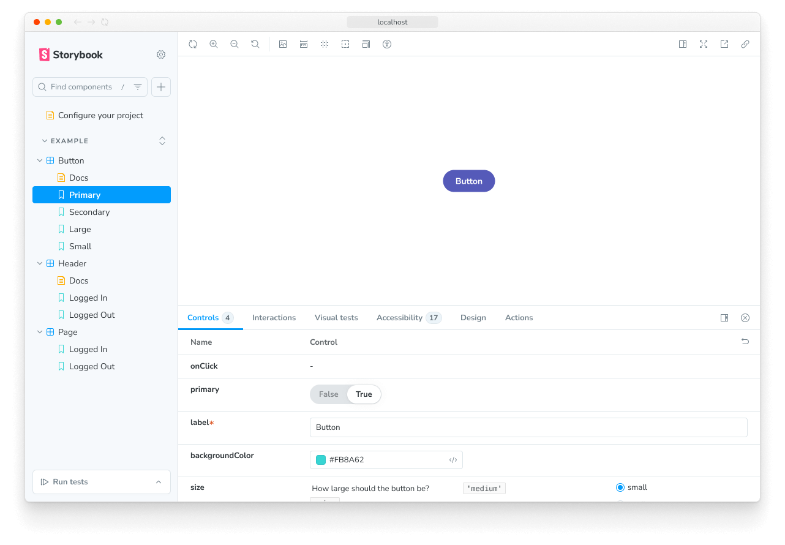

> 🌐 本文档由 [storybookjs/storybook](https://github.com/storybookjs/storybook) 翻译，英文原版见原项目。

Story 捕获 UI 组件的一个渲染状态。开发者为每个组件编写多个 stories，描述该组件能支持的所有“有趣”状态。

安装 Storybook 时，CLI 创建了示例组件，展示你可以用 Storybook 构建的组件类型：Button、Header 和 Page。

<If renderer="svelte">

每个示例组件都有一组 stories，展示它支持的状态。你可以在 UI 中浏览这些 stories，并在以 `.stories.svelte` 结尾的文件中查看其背后的代码。Stories 可以用[组件 Story 格式](../api/csf/index.mdx)（CSF）——一种基于 ES6 模块标准、用于编写组件示例的规范——来编写，也可以通过社区主导的 [`Svelte CSF`](https://storybook.js.org/addons/@storybook/addon-svelte-csf) 项目使用 Svelte 原生模板语法编写。

让我们从 `Button` 组件开始。在 Svelte 中，story 既可以用标准 CSF 定义为对象，也可以用 Svelte CSF 的 `Story` 组件定义。下面演示如何用这两种方式把 `Button` 渲染为 “primary” 状态，并导出一个名为 `Primary` 的 story。

</If>

<If notRenderer="svelte">

每个示例组件都有一组 stories，展示它支持的状态。你可以在 UI 中浏览这些 stories，并在以 `.stories.js|ts` 结尾的文件中查看其背后的代码。这些 stories 用[组件 Story 格式](../api/csf/index.mdx)（CSF）编写——一种基于 ES6 模块标准、用于编写组件示例的规范。

让我们从 `Button` 组件开始。Story 是一个对象，描述如何渲染对应组件。下面演示如何把 `Button` 渲染为 “primary” 状态，并导出一个名为 `Primary` 的 story。

</If>

<CodeSnippets path="button-story-with-args.md" />

在 Storybook 侧边栏中点击 `Button` 即可查看其渲染效果。注意 [`args`](../writing-stories/args.mdx) 中指定的值如何被用于渲染组件，并与 [Controls](../essentials/controls.mdx) 面板中呈现的值一一对应。在 story 中使用 `args` 还有额外好处：

- `Button` 的回调会被记录到 [Actions](../essentials/actions.mdx) 面板。点击试试。
- `Button` 的参数可以在 Controls 面板中动态编辑。调整一下这些控件。

## 操作 stories

Storybook 让你可以一次专注处理一个组件的一种状态（即一个 story）。当你修改组件代码或其 stories 时，Storybook 会立即在浏览器中重新渲染。无需手动刷新。

### 创建新 story

<If renderer="react">

如果你正在开发的组件还没有任何 stories，可以点击侧边栏的 ➕ 按钮，搜索你的组件，并让它为你生成一个基础 story。

<Video src="../_assets/get-started/new-component-story-from-plus-button-optimized.mp4" />

你也可以为新 story 创建 story 文件。我们建议复制/粘贴一个现有 story 文件到组件源文件旁，然后针对你的组件进行调整。

</If>

<If renderer="svelte">

<Callout variant="info">

Svelte 模板语法 story 格式不支持此功能。若要在 Svelte 中启用此功能，必须使用 Storybook 的[组件 Story 格式](../api/csf/index.mdx)。

</Callout>

</If>

<If notRenderer="react">

如果你正在开发的组件还没有任何 stories，可以为组件创建 story 文件并加入新 story。我们建议复制/粘贴一个现有 story 文件到组件源文件旁，然后针对你的组件进行调整。

</If>

<Video src="../_assets/get-started/new-component-story-in-code-optimized.mp4" />

如果你正在开发的组件已有其他 stories，可以使用 [Controls 面板](../essentials/controls.mdx)调整某个控件的值，然后把改动保存为新 story。

<Video src="../_assets/get-started/new-story-from-controls-optimized.mp4" />

或者，如果你愿意，也可以直接编辑 story 文件的代码，为你的 story 添加一个新的具名导出：

<Video src="../_assets/get-started/new-story-in-code-optimized.mp4" />

### 编辑 story

使用 [Controls 面板](../essentials/controls.mdx)更新 story 某个控件的值。然后保存对 story 的更改，story 文件的代码会自动更新。

<Video src="../_assets/get-started/edit-story-from-controls-optimized.mp4" />

当然，你也始终可以直接更新 story 的代码：

<Video src="../_assets/get-started/edit-story-in-code-optimized.mp4" />

Stories 还有助于确认你做改动之后 UI 依然显示正确。`Button` 组件有四个 stories，展示它在不同用例下的表现。现在就查看这些 stories，确认你对 `Primary` 的改动没有在其他 stories 中引入意外的 bug。

<Video src="../_assets/get-started/example-button-browse-stories-optimized.mp4" />

开发过程中随手检查组件的 stories，有助于防止意外的回归。[与 Storybook 集成的工具可以替你自动化这一过程](../writing-tests/index.mdx)。

我们已经了解了 story 的基本结构，接下来看看如何使用 Storybook 的 UI 来开发 stories。
