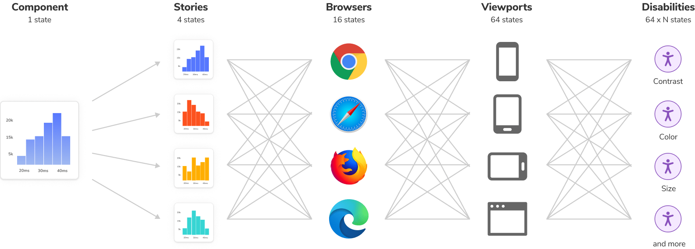

> 🌐 本文档由 [storybookjs/storybook](https://github.com/storybookjs/storybook) 翻译，英文原版见原项目。

## 问题所在

Web 的普适性正把越来越多的复杂度推向前端。一切始于响应式网页设计：它把每个用户界面从一个变成 10 个、100 个、1000 个不同的界面。随着时间推移，设备、浏览器、无障碍、性能、异步状态等更多需求不断叠加。

React、Vue 3、Angular 等组件驱动的工具帮助我们把复杂 UI 拆解成简单组件，但它们不是银弹。随着前端规模增长，组件数量急剧膨胀。成熟的项目可能包含数百个组件，衍生出数千种离散变体。

更麻烦的是，这些 UI 很难调试，因为它们与业务逻辑、交互状态和应用上下文纠缠在一起。

现代前端的广度压垮了现有工作流。开发者必须面对不计其数的 UI 变体，却没有工具去开发或组织它们。最终你会发现：UI 更难构建，开发体验更差，而且脆弱易碎。

## 解决方案

### 隔离构建 UI

如今每一段 UI 都是一个[组件](https://www.componentdriven.org/)。组件的超能力在于：你不需要启动整个应用就能看到它们的渲染效果。通过传入 props、mock 数据或伪造事件，你可以隔离地渲染某个特定变体。

Storybook 以一个小巧的、仅用于开发的[工作台（workshop）](https://bradfrost.com/blog/post/a-frontend-workshop-environment/)形式打包，与你的应用并存。它提供一个隔离的 iframe 来渲染组件，不受应用业务逻辑和上下文的干扰。这让你可以专注于开发组件的每一个变体，哪怕是难以触达的边界情况。

<Video src="../_assets/get-started/whats-a-story.mp4" />

### 把 UI 变体捕获为 "story"

在隔离开发某个组件变体时，把它保存为 story。[Story](../writing-stories/index.mdx) 是一种声明式语法，用于提供 props 和 mock 数据来模拟组件变体。每个组件可以有多个 stories。每个 story 让你展示该组件的一个特定变体，以验证其外观和行为。

你为细粒度的 UI 组件变体编写 stories，然后在开发、测试和文档中复用这些 stories。

<CodeSnippets path="histogram-story.md" />

### Storybook 记录每一个 story

Storybook 是你的 UI 组件及其 stories 的交互式目录。过去，你必须启动应用、跳转到某个页面，再把 UI 折腾到正确的状态。这极其浪费时间，拖慢前端开发。有了 Storybook，你可以跳过所有这些步骤，直接进入某个特定状态下 UI 组件的开发。

<Video src="../_assets/get-started/histogram-stories-optimized.mp4" />

Storybook 在我的项目中处于什么位置？

Storybook 以一个小巧的、仅用于开发的[工作台](https://bradfrost.com/blog/post/a-frontend-workshop-environment/)形式存在，与你的应用并存。通过[运行一条命令](../get-started/install.mdx)安装。

开发期间，在单独的 node 进程中运行它。如果你在隔离开发 UI，唯一需要运行的就是 Storybook。

Storybook 能配合我最喜欢的库吗？

Storybook 致力于与业界标准工具和平台集成，以简化安装。得益于我们积极的开发者社区，我们已经取得长足进展。有数百个 [addon](https://storybook.js.org/addons/) 和教程，讲解如何在各类项目中设置 Storybook。

如果你使用的是小众框架或刚发布的工具，我们可能还没有对应集成。可以考虑自己先做一个[概念验证](../addons/writing-addons.mdx)，为社区其他人铺路。

推荐的 Storybook 工作流是什么？

每个团队都不同，工作流也不同。Storybook 的设计支持渐进式采纳。团队可以逐步试用各项功能，看看什么最适合自己。

大多数社区成员选择[组件驱动（Component-Driven）](https://www.componentdriven.org/)工作流：UI 从基础组件开始“自底向上”隔离开发，然后逐步组合装配成页面。

1. 隔离构建每个组件，并为其变体编写 stories。
2. 把小组件组合起来，实现更复杂的功能。
3. 通过组合复合组件来装配页面。
4. 接入数据和业务逻辑，把页面集成进你的项目。

## 收益

为组件编写 stories 后，你会免费获得一堆额外收益。

**📝 开发更耐久的 UI**

隔离组件和页面，把它们的使用场景记录为 [stories](../writing-stories/index.mdx)。验证 UI 难以触达的边界情况。使用 addon 来 mock 组件所需的一切——上下文、API 请求、设备特性等。

**✅ 更省力、零抖动的 UI 测试**

Story 是追踪 UI 状态的务实且可复现的方式。在开发过程中用它做抽查测试。Storybook 为自动化[交互测试](../writing-tests/interaction-testing.mdx)、[无障碍测试](../writing-tests/accessibility-testing.mdx)和[视觉测试](../writing-tests/visual-testing.mdx)提供内置工作流。或者把 story 作为测试用例，[导入其他 JavaScript 测试工具](../writing-tests/integrations/stories-in-unit-tests.mdx)。

**📚 为团队撰写可复用的 UI 文档**

Storybook 是你 UI 的唯一事实来源。Stories 索引了所有组件及其各种状态，让团队轻松查找和复用现有 UI 模式。Storybook 还会根据这些 stories 自动生成[文档](../writing-docs/index.mdx)。

**📤 分享 UI 的真实运作方式**

Stories 展示 UI 实际如何运作，而不只是“理论上应该怎么运作”的图片。这让所有人对当前生产环境中的表现保持一致认知。[发布 Storybook](../sharing/publish-storybook.mdx) 以获得队友的确认。或者把它[嵌入](../sharing/embed.mdx) wiki、Markdown 和 Figma，精简协作流程。

**🚦自动化 UI 工作流**

Storybook 与你的持续集成工作流兼容。把它加为 CI 步骤，自动化 UI 测试、与队友协作评审实现，并获得利益相关者的签核。

## 一次编写 stories，处处复用

Storybook 由[组件 Story 格式（Component Story Format）](../api/csf/index.mdx)驱动，这是一个基于 JavaScript ES6 模块标准的开放标准。这让 story 可以在开发、测试和设计工具之间互操作。每个 story 都导出为 JavaScript 函数，让你可以在其他工具中复用。没有供应商锁定。

把 story 与 [Jest](https://jestjs.io/) 或 [Vitest](https://vitest.dev/) 及 [Testing Library](https://testing-library.com/) 复用来验证交互。放进 [Chromatic](https://www.chromatic.com/?utm_source=storybook_website&utm_medium=link&utm_campaign=storybook) 做视觉测试。用 [Axe](https://github.com/dequelabs/axe-core) 审计 story 的无障碍性。或用 [Playwright](https://playwright.dev/) 和 [Cypress](https://www.cypress.io/) 测试用户流程。复用让你零成本解锁更多工作流。

---

Storybook 专为帮助你更快开发复杂 UI 而生，更耐久、维护成本更低。数百家[领先公司](https://storybook.js.org/showcase)和成千上万的[开发者](https://github.com/storybookjs/storybook/)都在使用它。
